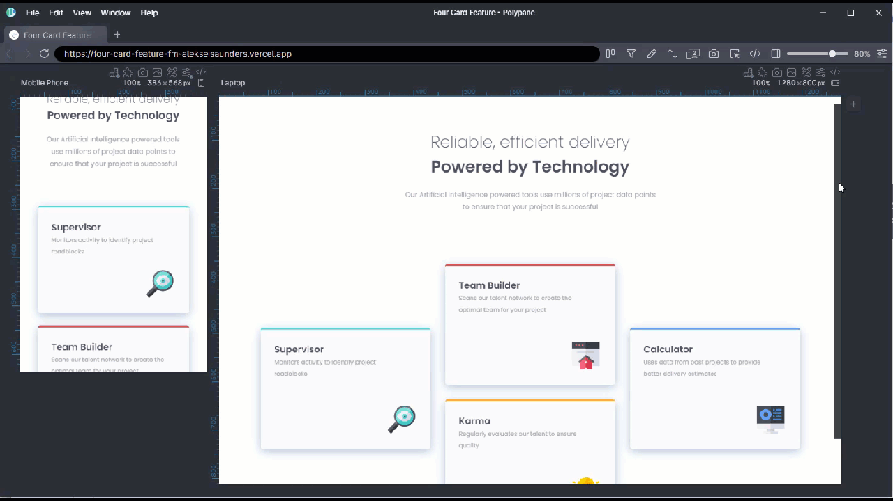

  
  
  
  
  

<h2 align="center">Technologies</h2>

    
    
    <!--  -->
    
    
    
    <!--
    
    
    
    -->
<!--      -->
    <!-- -->
     
    
    
    <!-- 
     -->
    
    <!--  -->

Currently using HTML, CSS, JavaScript, React, Node, Express, MongoDB, Mongoose, ejs, Bootstrap5. Previously I worked as a Zookeeper/Aquarist in Colorado, but I made the switch to Software Engineer. I'm driven to write code that helps causes and companies share their vision and change the world for the better, with a background in Biology, Conservation, and Education.

<!-- See [my website](#) for more information! -->

<h1 align="center">Projects</h1>
<table bordercolor="#66b2b2">
  
  <tr>
  <!-- Harmony Dog Website -->
  <td width="40%" valign="top">
      <h3 align="center">Harmony Dog</h3>
         
        
         
        

          
    
  
      

        
<strong>Javascript, HTML, CSS, NodeJS, Express, MongoDB, Mongoose, ejs, BootStrap5</strong> - Website for a Dog Training small business, user accounts, administration dashboard, class scheudle and Calendly integration

  </td>
    <!-- Naturalist Study Cards-->
    <td width="40%" valign="top">
      <h3 align="center">Naturalist Study Cards</h3>
         
        
         
        

          
    
  
      

        
<strong>Javascript, HTML, CSS, iNaturalist API call</strong> - Study card app that pulls images and data from iNaturalist and populates a deck of study cards based on your selections.

    </td>
</tr>
  <tr> 
<!-- Movie Finder with React-->
    <td width="40%" valign="top">
      <h3 align="center">Movie Finder using React</h3>
         
      
         
        

          
  
  
      

        
<strong>HTML, CSS, JavaScript, and React</strong> - My first React site. Built off of a solo project from Scrimba. Given an Figma file but no code I built the original using just HTML, CSS, and JavaScript. I added a color-mode selector for light/dark and decided to practice passing props into my React Components. 

    </td>
  <!-- Madagascar Fishes-->
  <td width="40%" valign="top">
      <h3 align="center">Madagascar Fishes</h3>
         
      
         
        

          
  
  
      

        
<strong>HTML, CSS</strong> - An informational site featuring the endemic freshwater fish of Madagascar, the efforts to conserve them in the wild, and the people working hard to do so.

    </td>
</tr>
<tr>
<!-- Frontend Mentor -->
    <td width="50%" valign="top">
      <h3 align="center">Frontend Mentor - Four Card Feature</h3>
       
        
       
        

  
  
          
      

        
<strong>HTML5, CSS3, and Figma</strong> - A Frontend Mentor practice site. Given a Fimga file code the site with HTML and CSS

    </td>
</tr>
  </table>
  <!-- <tr>
    <td width="50%" valign="top">
      <h3 align="center">ShawnCharles.com</h3>
       
        
       
        

  
  
      

        
<strong>HTML5, CSS3, & Javascript</strong> - Portfolio Site including links to my projects and ways to get in contact with me.

    </td>
    <td width="50%" valign="top">
      <h3 align="center">Matching Cards</h3>
         
        
         
        

          
  
  
      

        
<strong>HTML5, CSS3, & Javascript</strong> - With over 100 different cards, test your memory in these three popular trading card themes, Pokemon, Yugioh, & Magic: The Gathering!

    </td>
  </tr>
</table> -->

<h2 align="center">Technologies</h2>

    
    
    <!--  -->
    
    
    
    <!--
    
    
    
    -->
<!--      -->
    <!-- -->
     
    
    
    <!-- 
     -->
    
    <!--  -->

---

<h2 align="center">Connect</h2>

  
  
  
  
  

